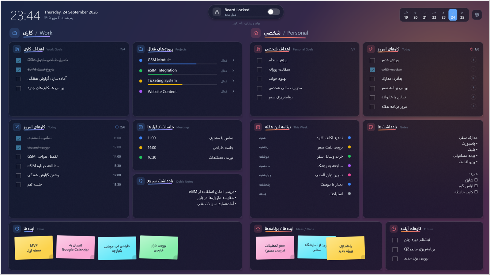

# Desktop Board — تخته دسکتاپ

Turn your Windows desktop into a persistent, glass-style productivity whiteboard: work on the
left, personal on the right, your desktop icons in a dock, everything saved locally and
automatically. Persian (RTL) is a first-class citizen; labels are bilingual.



## Features

- **Lives on the desktop** — a borderless window that sits directly above the wallpaper and
  below every other app. Win+D shows it; it never covers your work.
- **Unified desktop** — your Desktop shortcuts, folders and the Recycle Bin appear in a dock
  inside the board (Windows' own icons are hidden while the board runs and restored when it
  exits).
- **Work / کاری**: goals, active projects with progress, today's tasks, meetings, quick notes,
  sticky-note ideas. **Personal / شخصی**: goals, today, this week, notes, future tasks, ideas.
- **Lock / edit** — locked by default so stray desktop clicks change nothing; press and hold
  the pill (or `Ctrl+Shift+L`) to edit. `Ctrl+Shift+K` locks.
- **Autosave** to a local SQLite database; JSON backup export / import.
- Wallpaper blur & darkening, automatic UI scale for 1080p → 4K, glass effect toggle.
- Start with Windows (per-user, no admin), classic uninstaller in *Apps & features*.

## Install

1. Download `DesktopBoard-Setup-<version>.exe` from the
   [latest release](https://github.com/Rima-ex/desktop-board/releases/latest).
2. Run it. No administrator rights are needed; it installs under your user profile and
   bundles the .NET and Windows App SDK runtimes.
3. Windows 10 1809 or later (Windows 11 recommended).

**Uninstall**: *Settings → Apps → Desktop Board → Uninstall*. The uninstaller restores the
Windows desktop icons, removes the autostart entry and asks whether to delete your board data
(`%LOCALAPPDATA%\DesktopBoard`).

## Build from source

Requires the .NET SDK 8.0.4xx (no Visual Studio needed).

```powershell
dotnet test tests/DesktopBoard.Tests
dotnet build src/DesktopBoard.App -c Release -p:Platform=x64
# installer (needs Inno Setup 6):
dotnet publish src/DesktopBoard.App -c Release -r win-x64 --self-contained true -p:Platform=x64 -o publish
iscc installer\DesktopBoard.iss
```

Architecture, debugging switches and the Windows-shell decisions are documented in
[DEVELOPMENT.md](DEVELOPMENT.md).

## Privacy

Everything stays on your machine: one SQLite file and one log file in
`%LOCALAPPDATA%\DesktopBoard`. No network access, no telemetry.

## License

[MIT](LICENSE)
